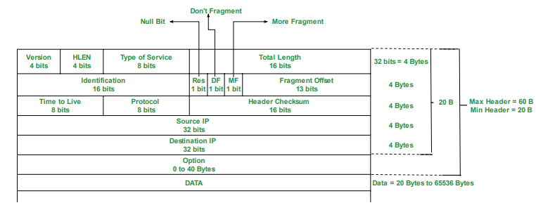

# Question bank

  <iframe src="https://drive.google.com/file/d/1pZCrl03iTDbRycVYDpydbNbi_cWuij40/preview" width="640" height="880" allow="autoplay" style="position: absolute; top: 0; left: 0; width: 100%; height: 100%;" frameborder="0" scrolling="no"></iframe>

## 1. Summarize the layers of OSI reference model with neat diagram.

The OSI (Open Systems Interconnection) reference model is a conceptual framework used to understand and describe how different networking protocols interact within a network. It consists of seven layers, each responsible for specific tasks. Here's a summary of each layer:

**Physical Layer (Layer 1):**

- Concerned with the physical transmission of data over the network medium.
- Defines specifications such as voltage levels, cable types, data rates, and physical connectors.
- Examples include Ethernet, Wi-Fi, and optical fiber.

**Data Link Layer (Layer 2):**

- Provides error-free transmission of data frames between adjacent nodes over a physical link.
- Responsible for framing, error detection, and flow control.
- Examples include Ethernet MAC (Media Access Control) and Point-to-Point Protocol (PPP).

**Network Layer (Layer 3):**

- Handles routing of data packets between different networks.
- Translates logical network addresses (IP addresses) into physical addresses (MAC addresses).
- Examples include Internet Protocol (IP) and Internet Control Message Protocol (ICMP).

**Transport Layer (Layer 4):**

- Ensures reliable end-to-end communication between hosts.
- Provides error detection, flow control, and segmentation of data.
- Examples include Transmission Control Protocol (TCP) and User Datagram Protocol (UDP).

**Session Layer (Layer 5):**

- Establishes, manages, and terminates sessions between applications.
- Provides mechanisms for synchronization and checkpointing during data exchange.
- Examples include NetBIOS and Remote Procedure Call (RPC).

**Presentation Layer (Layer 6):**

- Handles data translation, encryption, and compression to ensure compatibility between different systems.
- Converts data from application format to network format and vice versa.
- Examples include JPEG, MPEG, and ASCII.
 
**Application Layer (Layer 7):**
 
- Provides network services directly to end-users or applications.
- Implements protocols for tasks such as file transfer, email, and web browsing.
- Examples include HTTP, FTP, SMTP, and DNS.
- 

The diagram above illustrates the OSI model with each layer represented sequentially from the physical layer at the bottom to the application layer at the top.

## 2. Compare of OSI reference model and TCP/IP reference model

Both OSI (Open Systems Interconnection) reference model and TCP/IP (Transmission Control Protocol/Internet Protocol) reference model are used to understand and standardize communication protocols in computer networks. Here's a comparison between the two:

**OSI Reference Model:**

- Developed by the International Organization for Standardization (ISO).
- Consists of seven layers: Physical, Data Link, Network, Transport, Session, Presentation, and Application.
- Designed as a conceptual framework, providing a structured approach to networking.
- Each layer has specific functions and protocols associated with it.
- Offers a clear separation between different functions, promoting interoperability and modularity.
- Not widely implemented in practice but serves as a basis for understanding networking concepts.

**TCP/IP Reference Model:**

- Developed by the U.S. Department of Defense (DoD).
- Consists of four layers: Network Interface (Link), Internet, Transport, and Application.
- More closely reflects the architecture of the Internet and is widely used in practice.
- Often considered a practical implementation of the OSI model, with fewer layers.
- TCP/IP protocols, such as TCP, IP, UDP, and ICMP, are central to this model.
- Offers a flexible and scalable framework suitable for diverse networking environments.

**Comparison:**

- The OSI model provides a more detailed and theoretical framework, while the TCP/IP model is more practical and widely implemented.
- The OSI model has seven layers, while the TCP/IP model has four layers, with some overlapping functionality.
- Both models define standards for network communication but are used differently in practice.
- TCP/IP protocols are fundamental to the functioning of the Internet, whereas OSI protocols are less commonly implemented.
- The OSI model is often used for educational purposes and to understand networking concepts, while the TCP/IP model is used for actual network design and implementation.

## 3. Compare LAN, MAN, WAN in detail.	

| Basis             | LAN                                   | MAN                                   | WAN                                          |
|-------------------|---------------------------------------|---------------------------------------|----------------------------------------------|
| Full-Form         | LAN stands for local area network.    | MAN stands for metropolitan area network. | WAN stands for wide area network.            |
| Geographic Span   | Operates in small areas such as the same building or campus. | Operates in large areas such as a city. | Operates in larger areas such as country or continent. |
| Ownership         | LAN’s ownership is private.           | MAN’s ownership can be private or public. | WAN might not be owned by one organization. |
| Transmission Speed | The transmission speed of a LAN is high. | The transmission speed of a MAN is average. | The transmission speed of a WAN is low.     |
| Propagation delay | The propagation delay is short in a LAN. | There is a moderate propagation delay in a MAN. | There is a long propagation delay in a WAN. |
| Congestion        | There is less congestion in LAN.       | There is more congestion in MAN.       | There is more congestion than MAN in WAN.  |
| Design & Maintenance | LAN’s design and maintenance are easy. | MAN’s design and maintenance are difficult than LAN. | WAN’s design and maintenance are also difficult than LAN as well MAN. |
| Fault tolerance  | There is more fault tolerance in LAN. | There is less fault tolerance in MAN. | There is less fault tolerance in WAN.      |

## 4. Illustrate the Levels of addressing used in an internet employing the TCP/IP protocols

In an internet employing TCP/IP protocols, addressing is crucial for identifying and routing data packets across the network. TCP/IP uses several levels of addressing to ensure effective communication:

**Link Layer Addressing (MAC Address):**

- At the lowest level, each network interface (NIC) is assigned a unique Media Access Control (MAC) address.
- MAC addresses are 48 bits long and are typically represented in hexadecimal format.
- They are used for communication within the same physical network (LAN) and are assigned by the manufacturer of the network interface.
- Internet Layer Addressing (IP Address):

- The Internet Protocol (IP) layer provides logical addressing for hosts on a network.
- IP addresses are 32 bits (IPv4) or 128 bits (IPv6) long and are represented in decimal format.
- IPv4 addresses are divided into network and host portions, while IPv6 addresses use a hierarchical addressing structure.
- IP addresses are used for routing packets between networks and are assigned by network administrators or Internet Service Providers (ISPs).
- Transport Layer Addressing (Port Number):

Within the TCP/IP stack, the transport layer uses port numbers to distinguish between different applications or services running on a host.
Port numbers range from 0 to 65535 and are divided into well-known ports (0-1023), registered ports (1024-49151), and dynamic or private ports (49152-65535).
Port numbers, along with IP addresses, are used to deliver data to the appropriate application or service on a host.
Illustration:

Suppose a host (Host A) wants to communicate with another host (Host B) over the internet using TCP/IP protocols.
Host A encapsulates its data into packets, including the destination IP address of Host B.
The network layer (IP) examines the destination IP address to determine the next-hop router or destination network.
The link layer then encapsulates the IP packets into frames, adding the MAC address of the next-hop router or the destination host (if within the same LAN).
Finally, the frames are transmitted over the physical network, and each intermediate router or switch forwards the packets based on MAC addresses and IP addresses until they reach the destination host (Host B).

## 5. List the different types of switching techniques. Explain any one?

Different types of switching techniques:

- Circuit Switching:

In circuit switching, a dedicated communication path is established between two nodes before data transmission begins.
The path remains reserved for the duration of the communication session, regardless of whether data is being transmitted or not.
Examples of circuit-switched networks include traditional telephone networks (PSTN) and ISDN (Integrated Services Digital Network).
- Packet Switching:

Packet switching breaks data into small packets for transmission across a network.
Each packet contains information about its source, destination, and sequence number.
Packets are forwarded independently based on network conditions and available routes.
- Types of packet switching include:
Datagram Switching: Each packet is routed independently, and the route can vary for different packets.
Virtual Circuit Switching: Similar to circuit switching, but the dedicated path is established only for the duration of the communication session.
- Explanation of Packet Switching:

Packet switching is a technique used in computer networks to transmit data in the form of packets. Here's how it works:

**Packetization:** Data is divided into small packets for transmission. Each packet contains a portion of the original data along with header information.

**Routing:** Each packet is routed independently based on the destination address contained in its header. Routers examine the destination address and make decisions about the best path to forward the packet.

**Transmission:** Packets are transmitted across the network using available links and resources. They may take different routes and may arrive at the destination out of order.

**Reassembly:** Upon reaching the destination, packets are reassembled into the original data stream based on sequence numbers contained in the headers.

**Delivery:** The reassembled data is delivered to the destination application or service for processing.

Packet switching offers several advantages, including efficient use of network resources, scalability, and resilience to network failures. It allows multiple users to share the same network infrastructure while dynamically adapting to changing traffic patterns. Examples of packet-switched networks include the Internet (using TCP/IP) and Ethernet LANs.

## 6. Differentiate the Connection less & Connection oriented Services

| SS No. | Comparison Parameter | Connection-oriented Service | Connection Less Service |
|--------|----------------------|-----------------------------|-------------------------|
| 1.     | Related System       | Designed and developed based on the telephone system. | Service based on the postal system. |
| 2.     | Definition           | Used to create an end-to-end connection between senders and receivers before transmitting data over the same or different networks. | Used to transfer data packets between senders and receivers without creating any connection. |
| 3.     | Virtual Path         | Creates a virtual path between the sender and the receiver. | Does not create any virtual connection or path between the sender and the receiver. |
| 4.     | Authentication       | Requires authentication before transmitting data packets to the receiver. | Does not require authentication before transferring data packets. |
| 5.     | Data Packets Path    | All data packets are received in the same order as those sent by the sender. | Not all data packets are received in the same order as those sent by the sender. |
| 6.     | Bandwidth Requirement | Requires higher bandwidth to transfer data packets. | Requires low bandwidth to transfer data packets. |
| 7.     | Data Reliability     | More reliable connection service because it guarantees data packet transfer from one end to the other end with a connection. | Not a reliable connection service because it does not guarantee the transfer of data packets from one end to another for establishing a connection. |
| 8.     | Congestion           | No congestion as it provides an end-to-end connection between sender and receiver during data transmission. | May experience congestion due to not providing an end-to-end connection between the source and receiver for data packet transmission. |
| 9.     | Examples             | Transmission Control Protocol (TCP) | User Datagram Protocol (UDP), Internet Protocol (IP), and Internet Control Message Protocol (ICMP) |

## 7. Explain various connecting devices- Hub, Switch ,Router, Bridges ,Firewall and usage of each device

 **1. Hub**:

   - A hub is a basic networking device that operates at the physical layer (Layer 1) of the OSI model.
   - It is used to connect multiple Ethernet devices in a network, allowing them to communicate with each other.
   - Hubs operate in a broadcast domain, meaning that when a packet is received on one port, it is broadcasted out to all other ports.
   - They are simple and inexpensive but suffer from limitations such as collisions and limited bandwidth sharing among connected devices.
   - Hubs are rarely used in modern networks due to their inefficiency and susceptibility to collisions.

**2. Switch**:

   - A switch is a more advanced networking device that operates at the data link layer (Layer 2) of the OSI model.
   - It is used to connect multiple devices in a local area network (LAN) and provides dedicated communication channels between devices.
   - Switches use MAC address tables to intelligently forward data only to the device intended to receive it, reducing collisions and improving network efficiency.
   - They operate in a single collision domain per port, allowing full-duplex communication and higher bandwidth utilization.
   - Switches are commonly used in modern networks to segment LANs, improve performance, and enhance security.

**3. Router**:

   - A router is a networking device that operates at the network layer (Layer 3) of the OSI model.
   - It is used to connect multiple networks together and forward data packets between them based on IP addresses.
   - Routers use routing tables to determine the best path for packet transmission, considering factors such as network topology, traffic load, and routing protocols.
   - They provide traffic isolation between different network segments (subnets) and support features such as network address translation (NAT), DHCP, and firewall capabilities.
   - Routers are essential components of both local area networks (LANs) and wide area networks (WANs) and are crucial for interconnecting devices across the Internet.

**4. Bridge**:

   - A bridge is a networking device that operates at the data link layer (Layer 2) of the OSI model.
   - It is used to connect multiple network segments or LANs together and selectively forward data frames between them.
   - Bridges use MAC addresses to filter and forward traffic, effectively reducing collision domains and improving network performance.
   - They are commonly used to extend the size of LANs, segment network traffic, and isolate network problems.
   - Bridges are less commonly used in modern networks compared to switches, but they are still relevant in specific scenarios, such as legacy network environments.

**5. Firewall**:

   - A firewall is a network security device that monitors and controls incoming and outgoing network traffic based on predetermined security rules.
   - It is used to protect a network or device from unauthorized access, malware, and other security threats.
   - Firewalls can be implemented in various forms, including hardware appliances, software applications, or virtual appliances.
   - They inspect network packets, filter traffic based on IP addresses, port numbers, and application protocols, and enforce security policies to allow or block specific types of traffic.
   - Firewalls are essential components of network security infrastructure and are deployed at the perimeter of networks, between internal network segments, and on individual devices to safeguard against cyber attacks and data breaches.

Each of these connecting devices plays a crucial role in the functioning, performance, and security of computer networks, and their usage depends on the specific requirements and objectives of the network infrastructure.

## 8. Compare circuit switching Vs packet switching

| S.No | Parameter                     | Circuit Switching Network                                            | Packet Switching Network                                               |
|------|-------------------------------|----------------------------------------------------------------------|------------------------------------------------------------------------|
| 1    | Path                          | Dedicated path created between two points by setting the switches.  | No dedicated path created between two points. Only virtual circuit exists. |
| 2    | Store and forward transmission | No concept of store and forward transmission.                        | Each node may store incoming packets and forward them after use.        |
| 3    | Dedicated                     | Links making a path are dedicated and cannot be used for other connections. | Links making a route can be shared with other connections.            |
| 4    | Availability of Bandwidth     | Bandwidth is fixed and reserved in advance.                         | Bandwidth requirement is dynamic and can be released as needed.         |
| 5    | Route followed by packets     | Route followed by packets is always the same.                       | Route followed by packets may or may not be different.                  |
| 6    | Call setup                    | Call setup required.                                                | Call setup not required.                                               |
| 7    | Congestion                    | Congestion can occur at setup time.                                 | Congestion can occur on every packet.                                  |
| 8    | Wastage of Bandwidth          | Unused bandwidth on allocated circuit is wasted.                    | Unused bandwidth may be utilized by other packets.                     |
| 9    | Charging                      | Users charged based on time and distance.                           | Users charged based on time and number of bytes, not distance.          |
| 10   | Application                   | Telephone network for bidirectional, real-time transfer of voice signal. | Internet for datagram and reliable stream service between computers.   |
| 11   | Layers                        | Implemented at the physical layer.                                  | Implemented at the data link and network layers.                       |
| 12   | Reliability                   | Highly reliable.                                                    | Low reliability, subject to congestion.                                |

## 9. Differentiate between Classful and classless addressing.

| Sr. No. | Parameter                          | Classful Addressing                                                     | Classless Addressing                                                      |
|---------|------------------------------------|-------------------------------------------------------------------------|---------------------------------------------------------------------------|
| 1       | Basics                             | IP addresses are allocated according to the classes - A to E.            | Came to replace classful addressing to handle the issue of rapid IP address exhaustion. |
| 2       | Practical                          | Less practical.                                                          | More practical.                                                           |
| 3       | Network ID and Host ID             | Changes in the Network ID and Host ID depend on the class.               | No such restriction of class in classless addressing.                     |
| 4       | VLSM                               | Does not support Variable Length Subnet Mask (VLSM).                    | Supports Variable Length Subnet Mask (VLSM).                              |
| 5       | Bandwidth                          | Requires more bandwidth, making it slower and more expensive.            | Requires less bandwidth, making it faster and less expensive.             |
| 6       | CIDR                               | Does not support Classless Inter-Domain Routing (CIDR).                  | Supports Classless Inter-Domain Routing (CIDR).                          |
| 7       | Updates                            | Regular or periodic updates.                                             | Triggered Updates.                                                        |
| 8       | Troubleshooting and Problem detection | Easier due to division of network, host, and subnet parts in the address. | Not as easy as classful addressing.                                      |
| 9       | Division of Address                | - Network                                                               | - Network                                                                 |
|         |                                    | - Host                                                                  | - Host                                                                    |
|         |                                    | - Subnet                                                                | - Subnet                                                                  |

## 10. Write short note on Autonomous system

An Autonomous System (AS) is a collection of IP networks and routers under the control of a single organization or entity that presents a common routing policy to the Internet. ASes are assigned unique identification numbers known as Autonomous System Numbers (ASNs) by regional Internet registries (RIRs) such as ARIN, RIPE NCC, and APNIC.

**Usage of AS:**
1. **Internet Connectivity:** ASes provide connectivity to the Internet, allowing traffic to flow between networks.
2. **Routing Control:** ASes have control over routing decisions within their networks, determining how traffic is forwarded.
3. **Peering Agreements:** ASes establish peering agreements with other ASes to exchange traffic directly, reducing dependency on transit providers.
4. **Traffic Engineering:** ASes optimize routing paths to improve network performance, reduce latency, and manage congestion.

## 11.  192.168.5.131/26 for given address find out the 
**i) Subnet mask?**
**ii) What is first is first ip address for given series?**
**iii) What is last ip address for given series?**

**i) Subnet mask:** 
   The subnet mask for the given address 192.168.5.131/26 is 255.255.255.192 (/26 indicates 26 bits are used for the network portion, leaving 6 bits for the host portion).

**ii) First IP address:** 
   To find the first IP address in the given series, we need to determine the network address. Since the given IP address is in CIDR notation (/26), the network address is 192.168.5.128. So, the first IP address in the series is 192.168.5.129.

**iii) Last IP address:** 
   The last IP address in the series can be calculated by taking the network address and adding the total number of host addresses in the subnet. For a /26 subnet, there are 64 host addresses (2^6 = 64). So, the last IP address in the series is 192.168.5.192.

## 12. Discuss about Inter-network Routing Protocols used in Network layer in detail?

Inter-network Routing Protocols operate at the network layer (Layer 3) of the OSI model and are used to exchange routing information between routers in different autonomous systems or networks. Some commonly used inter-network routing protocols include:

1. **Border Gateway Protocol (BGP):** BGP is an exterior gateway protocol used to exchange routing and reachability information between autonomous systems on the Internet. It is designed to provide scalable and flexible routing capabilities, supporting policies for route selection and traffic engineering.

2. **Open Shortest Path First (OSPF):** OSPF is an interior gateway protocol used within autonomous systems to calculate the shortest path routes based on link-state information. It employs Dijkstra's shortest path algorithm to determine the best paths and supports features such as hierarchical routing, route summarization, and authentication.

3. **Intermediate System to Intermediate System (IS-IS):** IS-IS is another interior gateway protocol similar to OSPF that operates within autonomous systems. It uses a link-state routing algorithm and is widely used in Service Provider networks for scalability and stability.

## 13.Explain Distance Vector Routing protocol along with example

Distance Vector Routing Protocol is a type of routing algorithm used by routers to dynamically calculate the best path to reach a destination network. It operates based on two main principles:

1. **Distance:** The distance refers to the metric or cost associated with reaching a particular network. It can be measured in various units such as hop count, bandwidth, delay, or a combination of these factors.

2. **Vector:** The vector represents the direction or next-hop router towards the destination network.

**Example:** 
One of the most common examples of a distance vector routing protocol is the Routing Information Protocol (RIP). In RIP, routers periodically broadcast routing updates containing information about directly connected networks and their associated costs (hop counts). Routers use these updates to maintain their routing tables and make forwarding decisions.

## 14. Why count to infinity problem arises and how does to get solved?

The Count to Infinity problem arises in distance vector routing protocols when a router incorrectly believes it has discovered a shorter path to a destination network, leading to routing loops and network instability. This problem occurs due to the slow convergence of distance vector algorithms and the propagation of incorrect routing information.

**Solution:**
Several mechanisms are used to mitigate the Count to Infinity problem:
1. **Split Horizon:** Routers do not advertise routes back onto the interface from which they were learned.
2. **Poison Reverse:** Routers advertise a route with an infinite metric back to the router from which the route was learned.
3. **Hold-down Timers:** Routers temporarily ignore route updates for a certain period after detecting a change to prevent premature route selection.
4. **Triggered Updates:** Routers immediately send updates when a change in the network topology occurs to expedite convergence.
5. **Route Poisoning:** Routers advertise unreachable routes with an infinite metric to inform other routers about network failures.

By implementing these techniques, distance vector routing protocols can effectively prevent routing loops and maintain network stability.

## 15. Sketch and explain Header format of IPV4.

The IPv4 (Internet Protocol version 4) header is a fundamental component of the IPv4 packet structure. It contains essential information required for the transmission and delivery of data packets across IP networks. Below is a sketch and explanation of the IPv4 header format:

**Explanation of IPv4 Header Fields:**

**1. Version (4 bits):**
   - Indicates the version of the IP protocol being used. For IPv4, the value is 4.

**2. IHL (Internet Header Length) (4 bits):**
   - Specifies the length of the IP header in 32-bit words. The minimum value is 5 (indicating a 20-byte header), and the maximum value is 15.

**3. Type of Service (TOS) (8 bits):**
   - Used to define the quality of service (QoS) requirements for the packet, including priority, delay, throughput, and reliability.

**4. Total Length (16 bits):**
   - Specifies the total length of the IP packet, including the header and data, in bytes. The maximum value is 65535 bytes.

**5. Identification (16 bits):**
   - An identifier assigned by the sender to uniquely identify the fragmented packets belonging to the same original datagram.

**6. Flags (3 bits):**
   - Used in conjunction with the Fragment Offset field for fragmentation and reassembly of IP packets.
   - The three flags are:
     - Bit 0: Reserved, must be zero.
     - Bit 1: Don't Fragment (DF): Indicates that the packet should not be fragmented.
     - Bit 2: More Fragments (MF): Indicates whether there are more fragments following the current one.

**7. Fragment Offset (13 bits):**
   - Indicates the offset of the data in the current fragment relative to the original datagram.

**8. Time to Live (TTL) (8 bits):**
   - Specifies the maximum number of hops (routers) that the packet can traverse before being discarded.
   - Decremented by one at each hop, preventing packets from circulating indefinitely in the network.

**9. Protocol (8 bits):**
   - Indicates the protocol used in the data portion of the IP packet, such as TCP (6), UDP (17), ICMP (1), etc.

**10. Header Checksum (16 bits):**
    - A checksum calculated over the header to detect errors in the IP header during transmission.

**11. Source IP Address (32 bits):**
    - Specifies the source IP address of the sender.

**12. Destination IP Address (32 bits):**
    - Specifies the destination IP address of the recipient.

**13. Options (if any) (Variable length):**
    - Additional options and information that can be included in the IP header, such as record route, timestamp, etc.

**14. Padding (if any) (Variable length):**
    - Additional bits added to the header to ensure alignment to a 32-bit boundary.

Each field in the IPv4 header serves a specific purpose in the routing, forwarding, and delivery of IP packets across networks.

## 16. Compare IPV4 and IPV6 addressing system.

| Parameter                        | IPv4                                                           | IPv6                                                                         |
|----------------------------------|----------------------------------------------------------------|------------------------------------------------------------------------------|
| Address length                   | 32-bit address                                                 | 128-bit address                                                              |
| Fields                           | Numeric address with 4 fields separated by dot (.)            | Alphanumeric address with 8 fields separated by colon (:)                   |
| Classes                          | 5 classes: Class A, B, C, D, and E                            | Does not contain classes                                                    |
| Number of IP address             | Limited number                                                 | Large number                                                                 |
| VLSM                             | Supports VLSM (Virtual Length Subnet Mask)                     | Does not support VLSM                                                       |
| Address configuration            | Manual and DHCP configuration                                  | Manual, DHCP, auto-configuration, and renumbering                            |
| Address space                    | Generates 4 billion unique addresses                           | Generates 340 undecillion unique addresses                                   |
| End-to-end connection integrity  | Unachievable                                                   | Achievable                                                                   |
| Security features                | Security depends on the application, no built-in security      | IPSEC developed for security                                                |
| Address representation           | Represented in decimal                                         | Represented in hexadecimal                                                  |
| Fragmentation                    | Done by senders and forwarding routers                        | Done only by senders                                                         |
| Packet flow identification      | Does not provide mechanism for packet flow identification     | Uses flow label field in header for packet flow identification               |
| Checksum field                   | Available                                                      | Not available                                                                |
| Transmission scheme              | Broadcasting                                                   | Multicasting, provides efficient network operations                         |
| Encryption and Authentication    | Does not provide                                               | Provides                                                                    |
| Number of octets                 | Consists of 4 octets                                           | 8 fields, each containing 2 octets, totaling 16 octets in IPv6               |

## 17. A packet has arrived in which the offset value is 100, the value of HLEN is 5, and the value of the total length field is 100. What are the numbers of the first byte and the last byte?

**Given:**

- Offset value: 100
- HLEN (Header Length) value: 5
- Total Length field value: 100

**First, let's calculate the position of the first byte:**

- Offset value represents the number of 8-byte blocks from the beginning of the IP packet.
- Since the header length is 5, each header block is 4 bytes long (5 * 4 = 20 bytes).
- Therefore, the first byte is at position: 20 + (100 * 8) = 820 bytes.

**Next, let's find the position of the last byte:**

- Total Length field value represents the total length of the IP packet in bytes.
- The last byte is at position: 820 + (100 - 1) = 919 bytes.

So, the first byte is at position 820, and the last byte is at position 919.

## 18. Find the class, Net ID, Host ID and address range of the following IP addresses. (a)208.34.54.12 (2) 114.34.2.8

**(a) 208.34.54.12**

- Class: Class C (192.0.0.0 to 223.255.255.255)
- Net ID: 208.34.54 (First three octets)
- Host ID: 12 (Last octet)
- Address Range: 208.34.54.1 to 208.34.54.254 (excluding network address and broadcast address)

**(b) 114.34.2.8**

- Class: Class A (0.0.0.0 to 127.255.255.255)
- Net ID: 114 (First octet)
- Host ID: 34.2.8 (Last three octets)
- Address Range: 114.0.0.1 to 114.255.255.254 (excluding network address and broadcast address)

## 19. Explain Error reporting and Query messages of ICMP in detail

**Error Reporting:**

- ICMP (Internet Control Message Protocol) is used to report errors and provide feedback about IP packet processing.
- When a router or host encounters an error while processing an IP packet, it sends an ICMP error message back to the source of the packet.
- Common ICMP error messages include:
  - Destination Unreachable: Indicates that the destination host or network is unreachable.
  - Time Exceeded: Indicates that the TTL (Time to Live) field has expired.
  - Parameter Problem: Indicates an issue with the IP header or options.
- Error reporting ICMP messages help in diagnosing network connectivity issues and troubleshooting network problems.

**Query Messages:**

- ICMP is also used to send query messages to request information or verify the reachability of hosts.
- Common ICMP query messages include:
  - Echo Request (Ping): Used to check the reachability of a remote host by sending an ICMP Echo Request message.
  - Timestamp Request: Used to request the current time from a remote host.
  - Address Mask Request: Used to request the subnet mask of a remote host.
- Query messages are essential for network management and monitoring, allowing administrators to assess the status and performance of network devices.

## 20. Summarize ARP, RARP protocols in detail

**ARP (Address Resolution Protocol):**

- ARP is used to map IP addresses to MAC addresses within a local network.
- When a host wants to communicate with another host on the same subnet, it sends an ARP request broadcast containing the IP address of the target host.
- The target host with the corresponding IP address responds with its MAC address, allowing the requesting host to update its ARP cache.
- ARP operates at the data link layer (Layer 2) of the OSI model and is essential for Ethernet and other LAN technologies.

**RARP (Reverse Address Resolution Protocol):**

- RARP is the reverse of ARP, used to map MAC addresses to IP addresses.
- It allows diskless devices such as diskless workstations to obtain their IP addresses from a RARP server based on their MAC addresses.
- RARP requests are broadcasted on the local network, and RARP servers respond with the corresponding IP address.
- RARP is less commonly used today due to the prevalence of DHCP (Dynamic Host Configuration Protocol) for IP address assignment.

Both ARP and RARP play crucial roles in facilitating communication between devices on a local network by resolving IP and MAC addresses. However, DHCP has largely replaced RARP for dynamic IP address assignment, while ARP remains fundamental for IP address resolution in local networks.